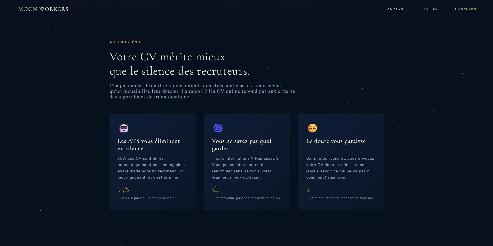
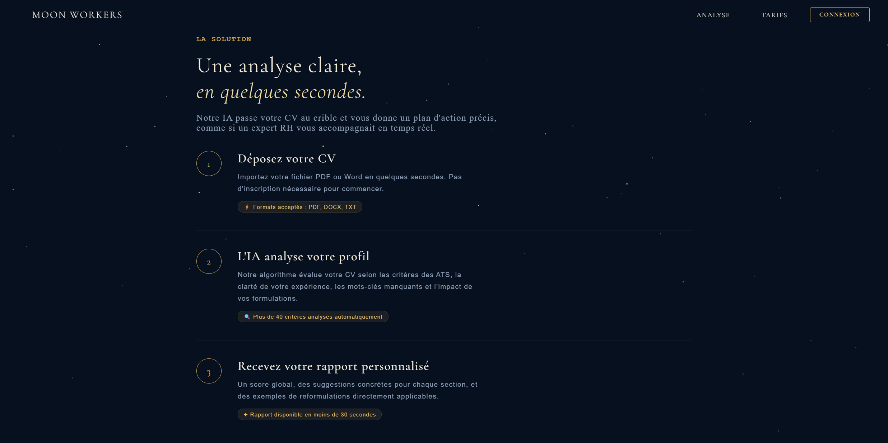
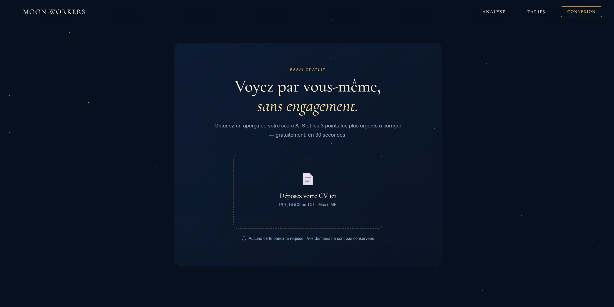
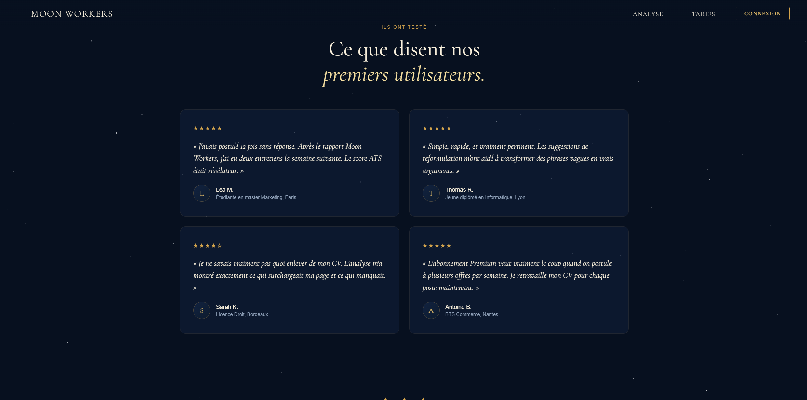
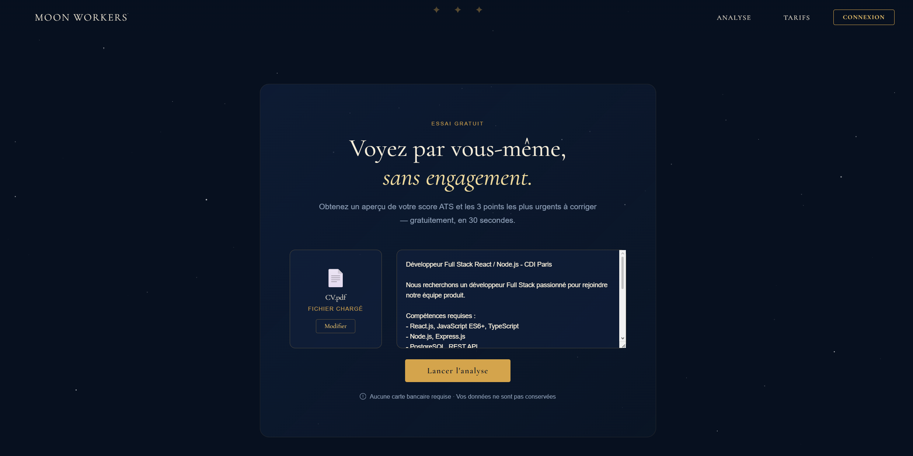
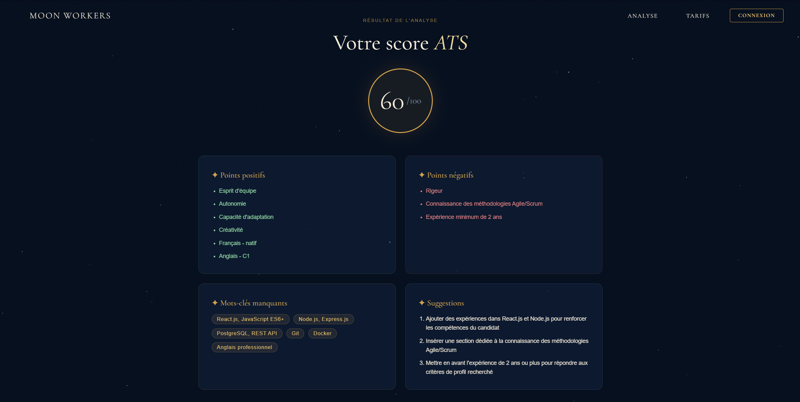

# Moon Workers

> AI-powered CV analyzer - Get your ATS score and personalized feedback in seconds.

## Description

**Moon Workers** is a full-stack web application that analyzes your CV against a job offer using a local **LLM** (Llama 3.2 via Ollama). It extracts text from your CV, compares it to the job description, and returns a structured analysis including an ATS score, strengths, weaknesses, missing keywords and actionable suggestions.

> Warning: **Note on result quality** - The analysis is powered by **Llama 3.2 (3B parameters)**, a lightweight local model. While functional, results may lack depth compared to larger models (GPT-4, Claude, Mistral Large). Upgrading to a larger model via Ollama will significantly improve output quality.

## Features

- CV upload (PDF, DOCX, TXT)
- Text extraction from uploaded files
- Job offer input for targeted analysis
- ATS score, strengths, weaknesses, missing keywords & suggestions
- Fully local LLM - no data sent to external APIs
- Docker support for easy deployment

## Tech stack

| Technology | Usage |
|---|---|
| React + Vite | Frontend |
| Node.js + Express | Backend |
| Llama 3.2 (Ollama) | Language model |
| pdf-parse + mammoth | CV text extraction |
| PostgreSQL | Database |
| Docker | Containerization |

## Screenshots

<div align="center">
  
</div>

<br/>

| | |
|---|---|
|  |  |
|  |  |
|  |  |

## Requirements

- Node.js 18+
- Docker Desktop

## Getting started

```bash
# Install dependencies
npm install
cd server && npm install && cd ..
cd client && npm install && cd ..

# Configure environment
cp .env.example .env   # Fill in your DB credentials

# Start the project (Docker + server + client)
npm run dev
```

On first launch, pull the LLM model :

```bash
docker exec -it resume-ai-rewiever-ollama-1 ollama pull llama3.2
```

## Project structure

```
├── client/        # React frontend (Vite)
├── server/        # Express backend
│   ├── routes/    # API routes (analyse.js)
│   └── db/        # PostgreSQL connection
├── docs/          # Screenshots
└── docker-compose.yml
```

## Author

**Sid Ali** - Universite de Bourgogne, M2 BDIA
